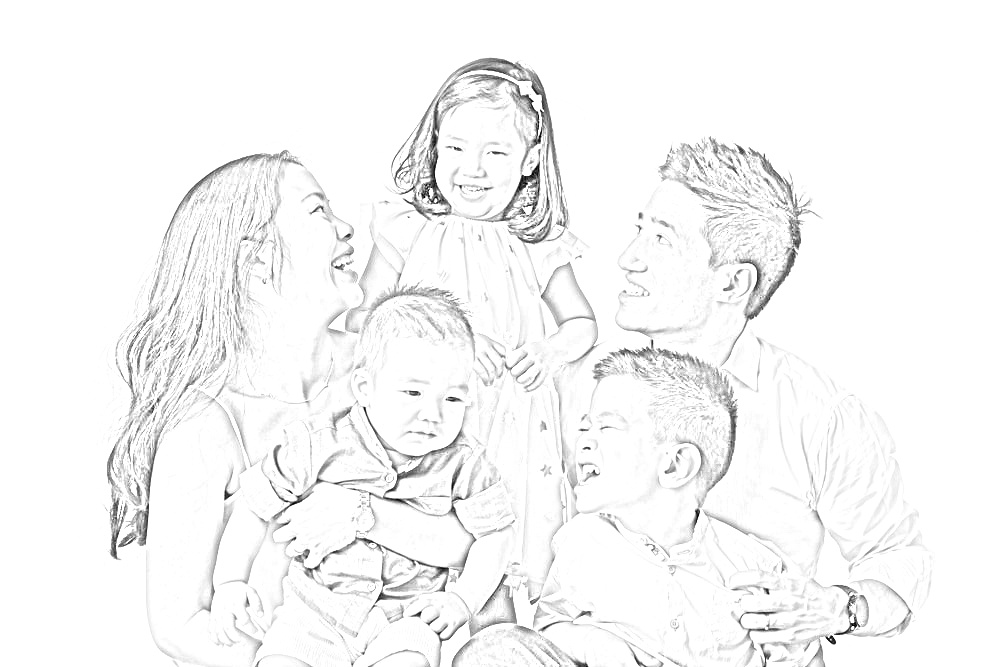

# Image Manuplation Library using Open CV

[](https://www.python.org/)                 
[](https://www.python.org/downloads/release/python-360/)   


## Deployed Version
https://pypi.org/project/py-imagizer/0.0.2/


## Functionality of the Library
- Image to Sketch Conversion
- Image to Cartoon Conversion
- Image to Water Color Conversion
- Image to Oil Paint Conversion
- Image to Color Pencil Painting
- Image to Dense Pencil Sketch
- Image Addition
- Image Subtraction
- RGB Image to HSV Conversion
- Image Translation
- Image Smoothening
- Image Translation
- Image Bilateral Filter


## Usage

- Make sure you have Python 3.10 installed in your system.
- Run Following command in the CMD.
 ```
  pip install py-imagizer
  ```
## Example

 ```python
# test.py
import py-imagizer as pi

## Make sure all the images to be used are in assets folder with proper path
image_path = "./assets/demo2.jpg"

# If you want to convert image to sketch then use following commands
image1_path = "./assets/demo2.jpg"
pi.image_to_sketch(image1_path)
  ```

## Run the following Script.
 ```
  python main.py
 ```

## Screenshots

is converted to 


## Different Functions

```python
    image_to_sketch()
    image_to_oilPaint()
    image_to_colorSketch()
    image_to_darkSketch()
    image_to_waterColor()
    image_addition()
    image_subtraction()
    bgr_hsv()
    smooth_image()
    image_translation()
    bilateral_filter()
```
